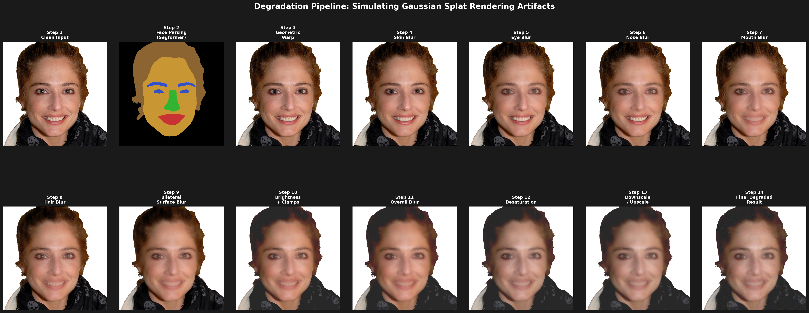
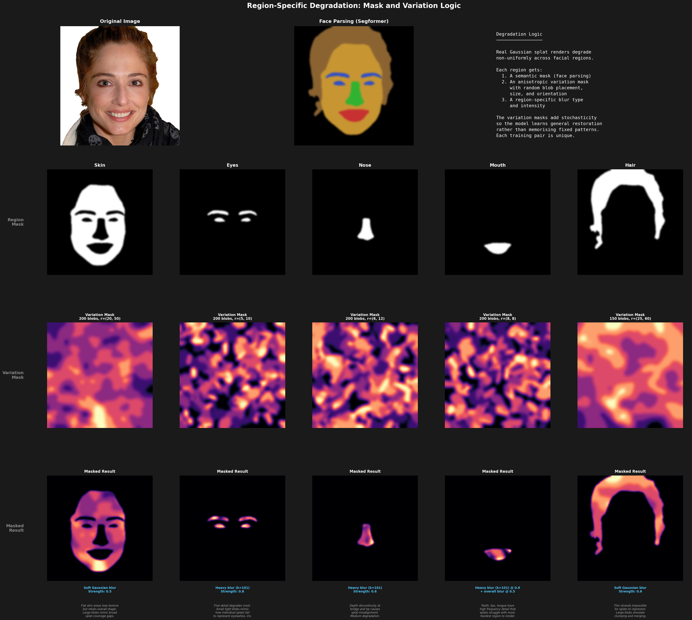

# Splat Enhancement: Single-Step Diffusion Image Enhancer

Technical test submission for the Signapse Computer Vision Research Engineer position. The approach adapts SD-Turbo with LoRA fine-tuning, following the pix2pix-turbo architecture. It is trained on synthetically degraded CelebA-HQ faces as a proxy for Gaussian splat avatar renders.

## Results

**Test set LPIPS: 0.203** (mean across 50 held-out test images)

| Metric | Value |
|--------|-------|
| LPIPS Mean | 0.2029 |
| LPIPS Median | 0.2006 |
| LPIPS Std | 0.0483 |
| Test Images | 50 |


Results shown are the top 8 by LPIPS from 50 randomly selected held-out test images.

[View all 50 test comparisons](results/comparisons/)

## Approach

### Architecture

Adapts SD-Turbo for paired image-to-image enhancement following the pix2pix-turbo approach:

- **VAE encoder** (frozen): Encodes degraded input to latent space, stores activations for skip connections
- **UNet** (LoRA rank 8): Processes latent at fixed timestep t=999. Only LoRA adapters and conv_in are trainable
- **VAE decoder** (LoRA rank 4): Reconstructs enhanced output with skip connections from encoder
- **Skip connections**: Four 1x1 convolutions bridging encoder to decoder, initialized near-zero
- **Skip dropout** (p=0.3): Dropout on skip connections to prevent overfitting and to stop the decoder from copying degraded input artifacts through to the output

About 4M trainable parameters out of 1B+ total.

### Loss Function

- **L1** (weight: 2.0): Pixel-level accuracy
- **LPIPS** (weight: 0.5): Perceptual similarity
- **Gram matrix** (weight: 0.01): Texture and style matching
- **CLIP similarity** (weight: 0.5): Semantic regulariser from pix2pix-turbo, reduced from the default of 5.0 after observing it was dominating the other losses in early training runs

### Data Pipeline

Working with Gaussian splat renders, I noticed that rendering artifacts are not uniform across the face. Fine features like eyes and mouth degrade more than flat skin regions. Hair produces entirely different artifacts.

The pipeline employs face parsing using Segformer to segment images into five regions, applying distinct blur types and intensities to each. An anisotropic variation mask is assigned to each region, resulting in patchy rather than uniform degradation which simulates the varied projection of individual Gaussians. This randomness also prevents the model from memorizing fixed patterns.





| Region | Blur Type | Strength | Rationale |
|--------|-----------|----------|-----------|
| Skin | Soft Gaussian | 0.5 | Loses texture but retains shape |
| Eyes | Heavy Gaussian | 0.8 | Fine detail degrades most |
| Nose | Heavy Gaussian | 0.6 | Depth discontinuity at bridge and tip |
| Mouth | Heavy Gaussian + overall | 0.9 | Teeth and lips hardest to render |
| Hair | Soft Gaussian | 0.6 | Thin strands merge and clump |

Additional global degradations: geometric warp, bilateral surface blur, brightness variation, overall blur, desaturation, downscale/upscale, and noise.

This is the first iteration of this approach, intended to demonstrate the concept and potential workflow. I based the degradation on splat artifacts that I have observed, but it would need further fine tuning and R&D to match the specific challenges from real Gaussian splat renders in the Signapse pipeline. I believe the quality and realism of training directly determine what the model can learn, regardless of training duration.

### Training

- **Dataset**: 500 CelebA-HQ images (450 train, 50 test) at 512x512
- **Hardware**: Personal Amazon EC2 instance with NVIDIA L40S GPU (48GB VRAM)
- **Steps**: 5000 (batch size 2, about 65 minutes)
- **Optimizer**: AdamW, lr=5e-5, fp16 mixed precision
- **Best checkpoint**: model_5000.pkl (val LPIPS: 0.202)

Validation LPIPS decreased from 0.333 at step 100 to 0.202 at step 5000.

## Repository Structure

```
Signapse_tech_test/
  data/
    prepare_data.py         # Degradation pipeline + train/test split
  model/
    architecture.py         # SplatEnhancer: SD-Turbo + LoRA + skip connections
    losses.py               # L1 + LPIPS + Gram matrix combined loss
  checkpoints/
    model_5000.pkl          # Best checkpoint (val LPIPS: 0.202)
  train.py                  # Training loop
  inference.py              # Inference + LPIPS evaluation + comparison grids
  requirements.txt
  README.md
  results/
    metrics.json            # Test set LPIPS scores
    comparisons/            # All 50 test comparison grids
    displays/               # Summary visualisations
```

## Setup and Usage

### Install

```bash
pip install -r requirements.txt
```

### Prepare Data

The pipeline expects RGBA images in `data/rgba_512/`. Download CelebA-HQ, resize to 512x512 with alpha channel, then:

```bash
python data/prepare_data.py --output_dir data --num_images 500
```

### Train

```bash
python train.py \
    --dataset_folder data \
    --batch_size 2 \
    --max_train_steps 5000 \
    --learning_rate 5e-5 \
    --lambda_l1 2.0 \
    --lambda_lpips 0.5 \
    --lambda_gram 0.01 \
    --lambda_clipsim 0.5 \
    --mixed_precision \
    --allow_tf32 \
    --output_dir output
```

### Inference

```bash
python inference.py \
    --checkpoint checkpoints/model_5000.pkl \
    --dataset_folder data \
    --output_dir results \
    --mixed_precision
```

**AI tools used**: Claude Opus 4.6 
